# Lab03-Review

## Challenge #1
>Write a program that asks the user for 3 numbers. Return the product of these 3 numbers multiplied together. If the user puts in less than 3 numbers, return 0; If the user puts in more than 3 numbers, only multiply the first 3. If the number is not a number, default that value to 1.

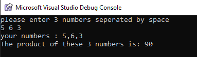

## Challenge #2
>Create a method that asks the user to enter a number between 2-10. Then, prompt the user that number of times for random numbers. After the user has inputted all of the numbers. Find the average of all the numbers inputted.

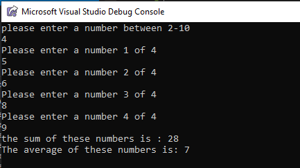

## Challenge #3
>Drawing a diamond using stars

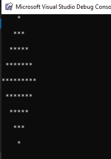

## Challenge #4
>Write a method that brings in an integer array and returns the number that appears the most times. If there are no duplicates, return the first number in the array. If more than one number show up the same amount of time, return the first found.

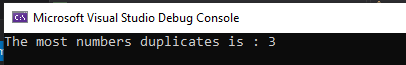

## Challenge #5
>Write a method in that finds the maximum value in the array. The array is not sorted. You may not use Array.Sort(); Tests: 1. Negative numbers 2. All values are the same

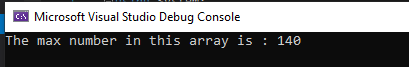

## Challenge #6
>Write a method that asks the user to input a word, and then saves that word into an external file named 'Words.txt'

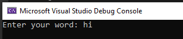

## Challenge #7
>Write a method that reads the file in from Challenge 6, and outputs the contents to the console.

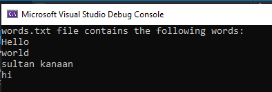

## Challenge #8
>Write a method that reads in the file from Challenge 6. Removes one of the words, and rewrites it back to the file.

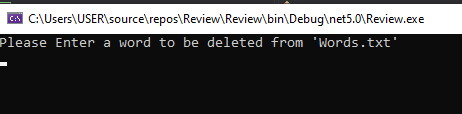

## Challenge #9
>Write a method that asks the user to input a sentence and returns an array that with the word and the number of characters each word has

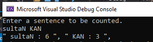

# Test unit
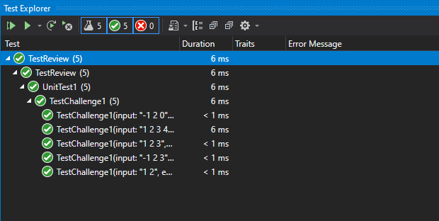
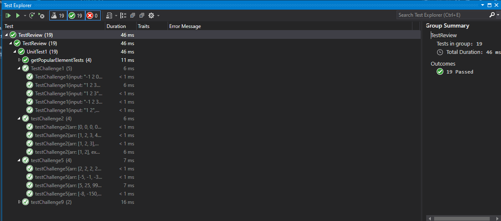
